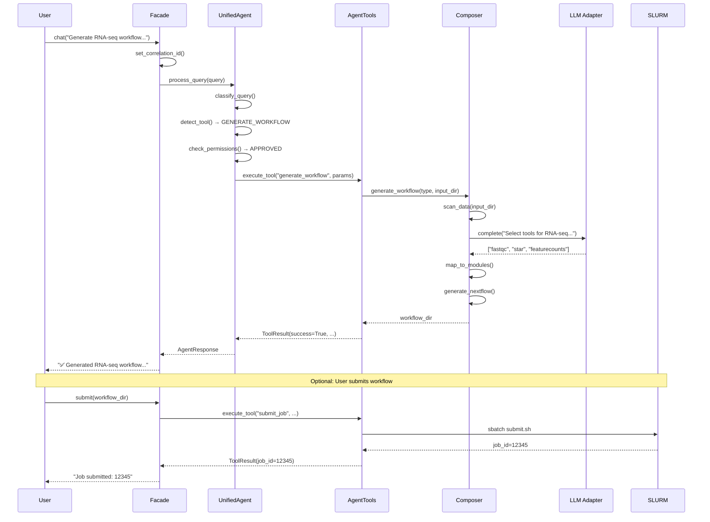

# BioPipelines Query Flow

**Version**: 2.0.0  
**Date**: November 29, 2025

---

## End-to-End Query Processing

This document describes how a user query flows through BioPipelines from input to result.

---

## Flow Diagram

```
┌──────────────────────────────────────────────────────────────────────────────┐
│                          USER QUERY FLOW                                      │
└──────────────────────────────────────────────────────────────────────────────┘

    User: "Generate an RNA-seq workflow for the FASTQ files in /data/samples"
                                    │
                                    ▼
┌──────────────────────────────────────────────────────────────────────────────┐
│  1. ENTRY POINT                                                               │
│  ┌────────────────────────────────────────────────────────────────────────┐  │
│  │  BioPipelines.chat(query)  OR  Web UI  OR  CLI                         │  │
│  │                                                                         │  │
│  │  • Sets correlation ID for request tracing                              │  │
│  │  • Logs: operation.started                                              │  │
│  └────────────────────────────────────────────────────────────────────────┘  │
└──────────────────────────────────────────────────────────────────────────────┘
                                    │
                                    ▼
┌──────────────────────────────────────────────────────────────────────────────┐
│  2. UNIFIED AGENT                                                             │
│  ┌────────────────────────────────────────────────────────────────────────┐  │
│  │  UnifiedAgent.process_query(query)                                      │  │
│  │                                                                         │  │
│  │  a) Query Classification                                                │  │
│  │     ├─ Detect intent: WORKFLOW_GENERATION                               │  │
│  │     ├─ Extract entities: pipeline_type="rnaseq", input_dir="/data"      │  │
│  │     └─ Classify category: WORKFLOW                                      │  │
│  │                                                                         │  │
│  │  b) Tool Detection                                                      │  │
│  │     ├─ Pattern matching against GENERATE_WORKFLOW_PATTERNS              │  │
│  │     ├─ Matched: "generate.*workflow"                                    │  │
│  │     └─ Tool: ToolName.GENERATE_WORKFLOW                                 │  │
│  │                                                                         │  │
│  │  c) Permission Check                                                    │  │
│  │     ├─ Tool permission: "write"                                         │  │
│  │     ├─ Autonomy level: GUIDED                                           │  │
│  │     └─ Check: APPROVED (write allowed in GUIDED mode)                   │  │
│  └────────────────────────────────────────────────────────────────────────┘  │
└──────────────────────────────────────────────────────────────────────────────┘
                                    │
                                    ▼
┌──────────────────────────────────────────────────────────────────────────────┐
│  3. TOOL EXECUTION                                                            │
│  ┌────────────────────────────────────────────────────────────────────────┐  │
│  │  AgentTools.execute_tool("generate_workflow", ...)                      │  │
│  │                                                                         │  │
│  │  a) Parameter Extraction                                                │  │
│  │     └─ {pipeline_type: "rnaseq", input_dir: "/data/samples"}            │  │
│  │                                                                         │  │
│  │  b) Tool Implementation                                                 │  │
│  │     ├─ generate_workflow_impl(pipeline_type, input_dir)                 │  │
│  │     ├─ Calls Composer for workflow generation                           │  │
│  │     └─ Uses LLM for intelligent tool selection                          │  │
│  └────────────────────────────────────────────────────────────────────────┘  │
└──────────────────────────────────────────────────────────────────────────────┘
                                    │
                                    ▼
┌──────────────────────────────────────────────────────────────────────────────┐
│  4. WORKFLOW COMPOSITION                                                      │
│  ┌────────────────────────────────────────────────────────────────────────┐  │
│  │  Composer.generate_workflow()                                           │  │
│  │                                                                         │  │
│  │  a) Data Scanning                                                       │  │
│  │     ├─ Scan /data/samples for FASTQ files                               │  │
│  │     └─ Detect: 4 paired-end samples (8 FASTQ files)                     │  │
│  │                                                                         │  │
│  │  b) Tool Selection (LLM-powered)                                        │  │
│  │     ├─ Query LLM: "Select tools for RNA-seq pipeline"                   │  │
│  │     └─ Selected: [fastqc, trimmomatic, star, featurecounts]             │  │
│  │                                                                         │  │
│  │  c) Module Mapping                                                      │  │
│  │     ├─ Map tools to nf-core modules                                     │  │
│  │     └─ Resolve container images                                         │  │
│  │                                                                         │  │
│  │  d) Template Generation                                                 │  │
│  │     ├─ Generate Nextflow DSL2 workflow                                  │  │
│  │     ├─ Create params.yml with sample sheet                              │  │
│  │     └─ Write to generated_workflows/rnaseq_20251129_123456/             │  │
│  └────────────────────────────────────────────────────────────────────────┘  │
└──────────────────────────────────────────────────────────────────────────────┘
                                    │
                                    ▼
┌──────────────────────────────────────────────────────────────────────────────┐
│  5. LLM INTERACTION                                                           │
│  ┌────────────────────────────────────────────────────────────────────────┐  │
│  │  LLM Adapter (vLLM / Ollama / OpenAI)                                   │  │
│  │                                                                         │  │
│  │  a) Provider Selection                                                  │  │
│  │     ├─ Check vLLM health → OK                                           │  │
│  │     └─ Use: VLLMAdapter (local GPU)                                     │  │
│  │                                                                         │  │
│  │  b) Prompt Construction                                                 │  │
│  │     ├─ System: "You are a bioinformatics workflow composer..."          │  │
│  │     └─ User: "Select tools for RNA-seq analysis of paired-end..."       │  │
│  │                                                                         │  │
│  │  c) Completion                                                          │  │
│  │     ├─ Request: POST /v1/chat/completions                               │  │
│  │     ├─ Model: Qwen/Qwen2.5-Coder-7B-Instruct                            │  │
│  │     └─ Response: JSON with tool selections                              │  │
│  └────────────────────────────────────────────────────────────────────────┘  │
└──────────────────────────────────────────────────────────────────────────────┘
                                    │
                                    ▼
┌──────────────────────────────────────────────────────────────────────────────┐
│  6. RESULT FORMATION                                                          │
│  ┌────────────────────────────────────────────────────────────────────────┐  │
│  │  ToolResult → AgentResponse                                             │  │
│  │                                                                         │  │
│  │  ToolResult:                                                            │  │
│  │    success: True                                                        │  │
│  │    tool_name: "generate_workflow"                                       │  │
│  │    message: "✅ Generated RNA-seq workflow with 4 steps"                │  │
│  │    data:                                                                │  │
│  │      workflow_dir: "generated_workflows/rnaseq_20251129_123456"         │  │
│  │      tools: ["fastqc", "trimmomatic", "star", "featurecounts"]          │  │
│  │      samples: 4                                                         │  │
│  │    suggestions:                                                         │  │
│  │      - "Submit with: bp.submit('generated_workflows/rnaseq_...')"       │  │
│  │      - "View workflow: nextflow run main.nf -preview"                   │  │
│  └────────────────────────────────────────────────────────────────────────┘  │
└──────────────────────────────────────────────────────────────────────────────┘
                                    │
                                    ▼
┌──────────────────────────────────────────────────────────────────────────────┐
│  7. RESPONSE DELIVERY                                                         │
│  ┌────────────────────────────────────────────────────────────────────────┐  │
│  │  Return to User                                                         │  │
│  │                                                                         │  │
│  │  AgentResponse:                                                         │  │
│  │    message: "✅ Generated RNA-seq workflow with 4 steps..."             │  │
│  │    tool_used: "generate_workflow"                                       │  │
│  │    data: {...}                                                          │  │
│  │    suggestions: [...]                                                   │  │
│  │                                                                         │  │
│  │  Logs: operation.completed, duration_ms=2345                            │  │
│  └────────────────────────────────────────────────────────────────────────┘  │
└──────────────────────────────────────────────────────────────────────────────┘
```

---

## Sequence Diagram (Mermaid)



---

## Error Flow

```
┌──────────────────────────────────────────────────────────────────────────────┐
│                            ERROR HANDLING FLOW                                │
└──────────────────────────────────────────────────────────────────────────────┘

    Error Occurs (e.g., LLM timeout)
                    │
                    ▼
┌─────────────────────────────────────────┐
│  Exception Raised                        │
│  LLMConnectionError("vLLM unreachable") │
│  error_code: 3001                        │
│  recoverable: True                       │
└────────────────────┬────────────────────┘
                     │
                     ▼
┌─────────────────────────────────────────┐
│  Error Handler                           │
│  • Log error with correlation_id         │
│  • Check if recoverable                  │
│  • Attempt fallback if possible          │
└────────────────────┬────────────────────┘
                     │
        ┌────────────┴────────────┐
        ▼                         ▼
┌───────────────────┐    ┌───────────────────┐
│  Fallback Success │    │  Fallback Failed  │
│                   │    │                   │
│  Try Ollama       │    │  Return error     │
│  adapter instead  │    │  to user with     │
│                   │    │  suggestions      │
└───────────────────┘    └───────────────────┘
```

---

## Data Discovery Flow

```
User: "Search for breast cancer methylation data"
                    │
                    ▼
┌─────────────────────────────────────────────────────────────────────────────┐
│  1. QUERY PARSING                                                            │
│     └─ Extract: organism="human", cancer_type="breast", data_type="methyl"  │
└─────────────────────────────────────────────────────────────────────────────┘
                    │
                    ▼
┌─────────────────────────────────────────────────────────────────────────────┐
│  2. PARALLEL DATABASE SEARCH                                                 │
│  ┌──────────┐  ┌──────────┐  ┌──────────┐  ┌──────────┐  ┌──────────┐       │
│  │   GEO    │  │  ENCODE  │  │   SRA    │  │  TCGA    │  │ Ensembl  │       │
│  │          │  │          │  │          │  │          │  │          │       │
│  │ 45 hits  │  │ 12 hits  │  │ 23 hits  │  │ 156 hits │  │  8 hits  │       │
│  └──────────┘  └──────────┘  └──────────┘  └──────────┘  └──────────┘       │
└─────────────────────────────────────────────────────────────────────────────┘
                    │
                    ▼
┌─────────────────────────────────────────────────────────────────────────────┐
│  3. RESULT AGGREGATION                                                       │
│     ├─ Deduplicate by accession                                              │
│     ├─ Rank by relevance score                                               │
│     └─ Format for display                                                    │
└─────────────────────────────────────────────────────────────────────────────┘
                    │
                    ▼
┌─────────────────────────────────────────────────────────────────────────────┐
│  4. RESPONSE                                                                 │
│     Found 187 datasets across 5 databases                                    │
│     Top results:                                                             │
│     • TCGA-BRCA (156 samples) - Breast cancer methylation 450K               │
│     • GSE123456 (45 samples) - Breast tumor methylation                      │
│     • ENCSR789012 (12 samples) - ENCODE breast tissue WGBS                   │
└─────────────────────────────────────────────────────────────────────────────┘
```

---

## Job Execution Flow

```
User: "Submit the workflow and monitor it"
                    │
                    ▼
┌─────────────────────────────────────────────────────────────────────────────┐
│  1. JOB SUBMISSION                                                           │
│  ┌─────────────────────────────────────────────────────────────────────┐    │
│  │  submit_job_impl(workflow_dir)                                       │    │
│  │  • Validate workflow exists                                          │    │
│  │  • Generate SLURM script                                             │    │
│  │  • sbatch --parsable submit.sh                                       │    │
│  │  • Return job_id: 12345                                              │    │
│  └─────────────────────────────────────────────────────────────────────┘    │
└─────────────────────────────────────────────────────────────────────────────┘
                    │
                    ▼
┌─────────────────────────────────────────────────────────────────────────────┐
│  2. JOB MONITORING (Background)                                              │
│  ┌─────────────────────────────────────────────────────────────────────┐    │
│  │  SelfHealingAgent.monitor(job_id)                                    │    │
│  │                                                                      │    │
│  │  Loop every 30s:                                                     │    │
│  │  ├─ squeue -j 12345 → RUNNING                                        │    │
│  │  ├─ Check Nextflow progress                                          │    │
│  │  ├─ Parse .nextflow.log for errors                                   │    │
│  │  └─ If FAILED → trigger diagnosis                                    │    │
│  └─────────────────────────────────────────────────────────────────────┘    │
└─────────────────────────────────────────────────────────────────────────────┘
                    │
                    ▼
┌─────────────────────────────────────────────────────────────────────────────┐
│  3. ERROR DETECTION & RECOVERY                                               │
│  ┌─────────────────────────────────────────────────────────────────────┐    │
│  │  If error detected:                                                  │    │
│  │  ├─ Collect logs (slurm-12345.out, .nextflow.log)                    │    │
│  │  ├─ Match against 50+ error patterns                                 │    │
│  │  ├─ Diagnose with LLM if pattern unclear                             │    │
│  │  └─ Attempt auto-fix if safe:                                        │    │
│  │      • OOM → resubmit with 2x memory                                 │    │
│  │      • Missing module → module load                                  │    │
│  │      • Network timeout → retry                                       │    │
│  └─────────────────────────────────────────────────────────────────────┘    │
└─────────────────────────────────────────────────────────────────────────────┘
                    │
                    ▼
┌─────────────────────────────────────────────────────────────────────────────┐
│  4. COMPLETION                                                               │
│     Job completed successfully                                               │
│     Results: /data/results/rnaseq_20251129_123456/                           │
│     • multiqc_report.html                                                    │
│     • counts/gene_counts.tsv                                                 │
│     • bam/*.sorted.bam                                                       │
└─────────────────────────────────────────────────────────────────────────────┘
```

---

## Request Tracing

All requests are traced using correlation IDs:

```
[2025-11-29 12:34:56] correlation_id=req-abc123
├─ [INFO] operation.started op=chat query="Generate RNA-seq..."
├─ [DEBUG] agent.classify intent=WORKFLOW_GENERATION
├─ [DEBUG] agent.detect_tool tool=generate_workflow
├─ [INFO] tool.execute tool=generate_workflow
│   ├─ [DEBUG] composer.scan_data path=/data/samples files=8
│   ├─ [DEBUG] llm.request provider=vllm model=qwen2.5-coder
│   ├─ [DEBUG] llm.response tokens=256 duration_ms=450
│   └─ [INFO] composer.generate workflow_id=rnaseq_20251129
├─ [INFO] tool.complete tool=generate_workflow success=true
└─ [INFO] operation.completed op=chat duration_ms=2345
```
